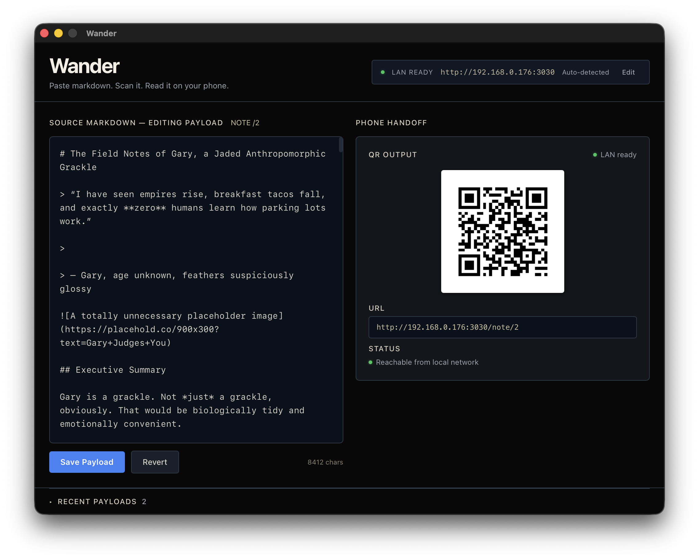
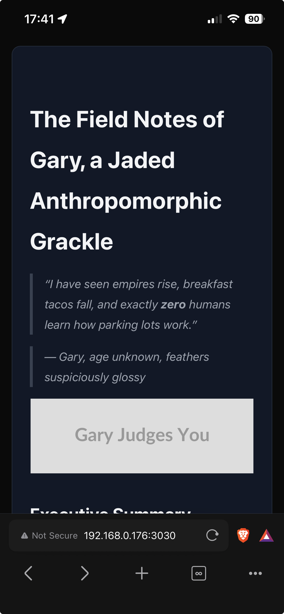

# Wander

> Paste markdown, generate a QR code, read it on your phone while you wander around.

Wander is a tiny desktop app for copying text you need to read — meeting notes, documentation, recipes, anything — and instantly making it available on your phone via a QR code. No cloud, no auth, no accounts. Just your laptop and your phone on the same Wi-Fi.

Built with **Wails v2** (Go backend + React frontend), **SQLite**, and **server-side markdown rendering**.

---

## What It Does

1. **Paste markdown** into the desktop app.
2. **Click "Save Payload"** — a QR code appears.
3. **Scan the QR with your phone** — it opens a clean, beautifully rendered page on your local network.
4. **Wander away** and read it. That's it.

Notes are stored in a local SQLite database in `~/.wander/wander.db`. They stick around between sessions but are ephemeral by design.

---

## Screenshots

| Desktop | Mobile Viewer |
|---------|---------------|
|  |  |

*Left: The desktop app with the markdown editor, QR code panel, and recent payloads drawer. Right: The phone viewer — a clean, server-rendered markdown page with syntax highlighting and dark mode.*

---

## Quick Start

### Prerequisites

- **Go 1.25+**
- **Node.js 18+**
- **Wails CLI v2.10+**: `go install github.com/wailsapp/wails/v2/cmd/wails@latest`

### Development

```bash
# Install frontend dependencies
cd frontend && npm install && cd ..

# Run in dev mode (hot reload for frontend + Go backend)
wails dev
```

### Production Build

```bash
# macOS (arm64)
wails build

# macOS (universal)
wails build -platform darwin/universal

# Windows (from macOS)
wails build -platform windows/amd64

# Linux
wails build -platform linux/amd64
```

Outputs are in `build/bin/`.

---

## How It Works

### LAN Access
Wander auto-detects your machine's local network IP (e.g., `192.168.1.x`) and constructs the QR code URL as `http://<ip>:3030/note/<id>`. The editable LAN base URL field lets you override this if you're on a VPN or the auto-detect picks the wrong interface.

### No Authentication
The `/note/:id` route is public by design. Anyone on your local network can scan the QR and read the note. There is no auth layer — this is intentional for the "wander around" use case.

### Port Handling
The HTTP sidecar starts at port **3030** and automatically increments if the port is taken. The actual port is displayed in the desktop app.

### Markdown Rendering
- **Desktop app**: `react-markdown` + `remark-gfm` + `rehype-raw` + `react-syntax-highlighter` (Prism)
- **Phone viewer**: Server-side rendered with `goldmark` + GFM extension + DefinitionList extension + Chroma syntax highlighting + raw HTML support. Includes Mermaid.js for diagram rendering. Pure HTML/CSS with no JavaScript required for basic markdown.

---

## Features

- **Full GitHub Flavored Markdown** — tables, strikethrough, task lists, autolinks, definition lists
- **Mermaid diagrams** — `\`\`\`mermaid` blocks render as diagrams in the phone viewer
- **Syntax highlighting** — code blocks rendered with Prism (desktop) and Chroma (viewer)
- **QR code generation** — server-side PNG, displayed as base64 Data URL
- **Note management** — create, edit, delete, regenerate QR for existing notes
- **Relative timestamps** — notes show "2h ago", "3d ago", etc.
- **Heading anchor links** — auto-generated IDs for table of contents
- **Raw HTML** — `<details>`, `<summary>`, and other inline HTML renders correctly
- **Dark mode** — easy on the eyes, phone-friendly
- **SQLite persistence** — notes survive restarts

---

## Tech Stack

| Layer | Tech |
|-------|------|
| Desktop Shell | Wails v2 (Go + Webview) |
| Frontend | React 19 + Vite + Tailwind CSS |
| Backend | Go 1.25+ |
| Database | SQLite via `modernc.org/sqlite` (CGO-free) |
| QR Codes | `skip2/go-qrcode` |
| Desktop Markdown | `react-markdown` + `remark-gfm` + `rehype-raw` + `react-syntax-highlighter` |
| Viewer Markdown | `goldmark` + `extension.GFM` + `extension.DefinitionList` + `goldmark-highlighting` + `html.WithUnsafe` (Chroma) |

---

## Project Structure

```
wander/
├── app.go                      # Wails App struct + Go bindings
├── main.go                     # Entry point
├── wails.json                  # Wails config
├── go.mod / go.sum
├── internal/
│   ├── db/
│   │   └── db.go               # SQLite CRUD + schema init
│   ├── lan/
│   │   └── lan.go              # Auto-detect LAN IP
│   ├── port/
│   │   └── port.go             # findAvailablePort()
│   ├── qr/
│   │   └── qr.go               # QR generation (PNG → base64)
│   ├── markdown/
│   │   └── markdown.go         # goldmark + GFM + Chroma highlighting
│   └── server/
│       ├── server.go           # HTTP sidecar setup + /note/:id handler
│       └── template.go         # Embedded viewer HTML/CSS
├── frontend/                    # Vite + React
│   ├── src/
│   │   ├── App.tsx             # Main dashboard (single page, panels)
│   │   ├── components/
│   │   │   ├── NoteEditor.tsx  # Markdown textarea
│   │   │   ├── RecentPayloads.tsx # Notes list with actions
│   │   │   └── QrPanel.tsx     # QR display
│   │   └── main.tsx
│   ├── index.html
│   └── vite.config.ts
└── build/
    ├── bin/
    │   └── Wander.app (macOS)
    │   └── Wander.exe (Windows)
    │   └── wander (Linux)
    └── ...
```

---

## Database

SQLite file lives at `~/.wander/wander.db`. It is created automatically on first run. Schema:

```sql
CREATE TABLE notes (
  id INTEGER PRIMARY KEY AUTOINCREMENT,
  content TEXT NOT NULL,
  created_at DATETIME DEFAULT CURRENT_TIMESTAMP
);
```

WAL mode is enabled for better concurrent read performance.

---

## Development

### Scripts

| Script | Description |
|--------|-------------|
| `wails dev` | Start dev mode with hot reload |
| `wails build` | Build for production (current platform) |
| `wails build -platform <target>` | Cross-compile |

### LAN Development

The HTTP server binds to `0.0.0.0` so it's accessible from any device on your network. No special configuration needed — just ensure both devices are on the same Wi-Fi.

---

## Why Wails?

Wails gives us a lightweight desktop shell with a native webview, Go backend bindings, and trivial cross-compilation. The entire app is a single static binary per platform with no runtime dependencies.

`modernc.org/sqlite` keeps the build CGO-free, so cross-compiling to Windows and Linux from your Mac is a one-liner.

---

## License

MIT — see [LICENSE](LICENSE).

Copyright (c) 2026 [Aggressively Beige Holdings, LLC](https://www.agbeige.com/)
